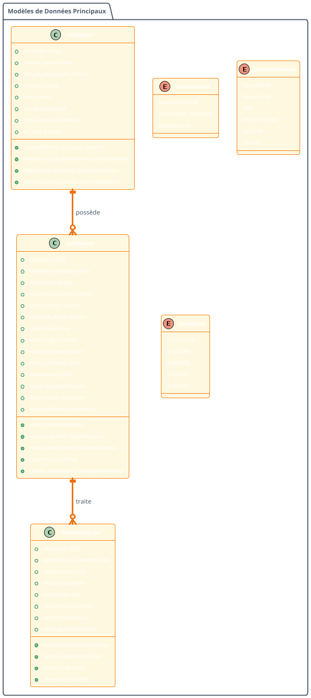
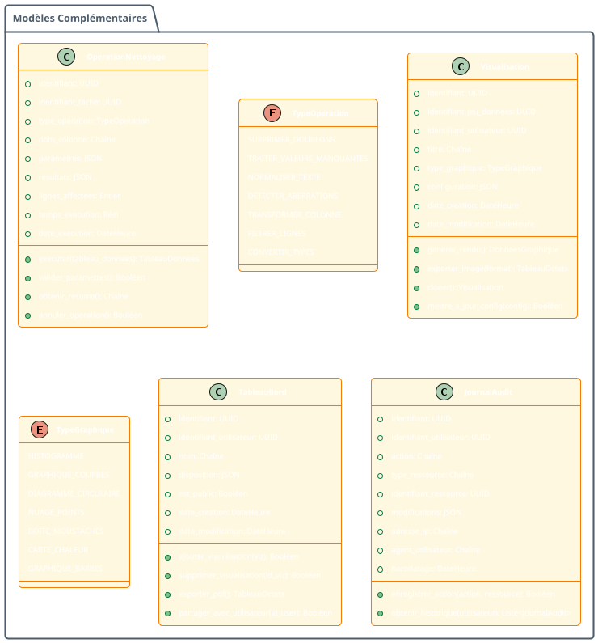
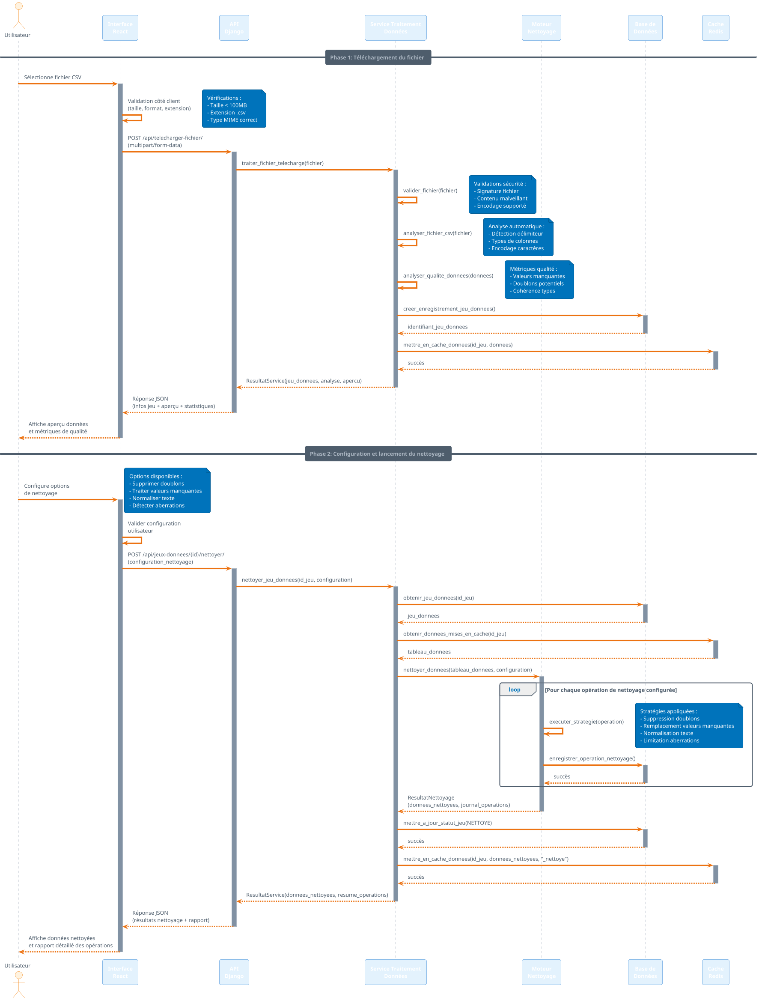

# 🎨 CODES UML COMPLETS EN FRANÇAIS - DIMACLEAN

## 📋 GUIDE D'UTILISATION

### **Outils Recommandés :**
- **PlantUML Online** : http://www.plantuml.com/plantuml/uml/
- **VS Code Extension** : PlantUML (jebbs.plantuml)
- **Draw.io** : https://app.diagrams.net/ (import PlantUML)

### **Instructions :**
1. Copiez le code PlantUML souhaité
2. Collez-le dans votre outil PlantUML
3. Générez le diagramme (PNG, SVG, PDF)
4. Intégrez dans votre rapport de stage

---

## 1. 📊 DIAGRAMME DE CAS D'USAGE

```plantuml
@startuml DiagrammeCasUsage_DimaClean
!theme aws-orange
!define RECTANGLE_COLOR #E3F2FD
!define ACTOR_COLOR #1976D2

skinparam actor {
  BackgroundColor ACTOR_COLOR
  BorderColor #0D47A1
  FontColor white
  FontStyle bold
}

skinparam usecase {
  BackgroundColor #FFF3E0
  BorderColor #F57C00
  FontSize 11
}

skinparam package {
  BackgroundColor RECTANGLE_COLOR
  BorderColor #1976D2
  FontStyle bold
}

left to right direction

actor "Utilisateur\nStandard" as UtilisateurStandard
actor "Administrateur\nSystème" as AdminSysteme

rectangle "Système DimaClean" {
  
  package "Gestion des Fichiers" {
    usecase "Importer Fichier\nCSV" as UC01
    usecase "Prévisualiser\nDonnées" as UC02
    usecase "Gérer Liste\nFichiers" as UC03
    usecase "Supprimer\nFichier" as UC04
  }
  
  package "Traitement des Données" {
    usecase "Nettoyer\nDonnées" as UC05
    usecase "Transformer\nDonnées" as UC06
    usecase "Calculer\nStatistiques" as UC07
    usecase "Détecter\nDoublons" as UC08
    usecase "Gérer Valeurs\nManquantes" as UC09
  }
  
  package "Visualisation" {
    usecase "Créer\nGraphiques" as UC10
    usecase "Personnaliser\nTableau de Bord" as UC11
    usecase "Exporter\nVisualisations" as UC12
    usecase "Configurer\nAffichage" as UC13
  }
  
  package "Export et Rapports" {
    usecase "Exporter CSV\nNettoyé" as UC14
    usecase "Générer Rapport\nPDF" as UC15
    usecase "Télécharger\nRésultats" as UC16
  }
  
  package "Administration" {
    usecase "Gérer Comptes\nUtilisateurs" as UC17
    usecase "Superviser\nActivité Système" as UC18
    usecase "Consulter Journaux\nAudit" as UC19
    usecase "Configurer\nParamètres" as UC20
  }
  
  package "Authentification" {
    usecase "Se Connecter\nau Système" as UC21
    usecase "Gérer Profil\nUtilisateur" as UC22
    usecase "Changer Mot\nde Passe" as UC23
  }
}

' Relations Utilisateur Standard
UtilisateurStandard --> UC01
UtilisateurStandard --> UC02
UtilisateurStandard --> UC03
UtilisateurStandard --> UC04
UtilisateurStandard --> UC05
UtilisateurStandard --> UC06
UtilisateurStandard --> UC07
UtilisateurStandard --> UC08
UtilisateurStandard --> UC09
UtilisateurStandard --> UC10
UtilisateurStandard --> UC11
UtilisateurStandard --> UC12
UtilisateurStandard --> UC13
UtilisateurStandard --> UC14
UtilisateurStandard --> UC15
UtilisateurStandard --> UC16
UtilisateurStandard --> UC21
UtilisateurStandard --> UC22
UtilisateurStandard --> UC23

' Relations Administrateur
AdminSysteme --> UC17
AdminSysteme --> UC18
AdminSysteme --> UC19
AdminSysteme --> UC20
AdminSysteme --> UC21
AdminSysteme --> UC22
AdminSysteme --> UC23

' Extensions et Inclusions
UC01 ..> UC02 : <<inclut>>
UC05 ..> UC08 : <<inclut>>
UC05 ..> UC09 : <<inclut>>
UC05 ..> UC07 : <<inclut>>
UC10 ..> UC11 : <<étend>>
UC15 ..> UC07 : <<inclut>>
UC22 ..> UC23 : <<étend>>

' Notes explicatives
note right of UC05
  Nettoyage automatique inclut :
  - Suppression des doublons
  - Traitement valeurs manquantes
  - Normalisation des formats
  - Détection des aberrations
end note

note right of UC10
  Types de graphiques supportés :
  - Histogrammes
  - Graphiques en courbes
  - Diagrammes circulaires
  - Boîtes à moustaches
  - Nuages de points
end note

note bottom of UC17
  Gestion utilisateurs :
  - Création de comptes
  - Modification des droits
  - Désactivation/Suppression
  - Réinitialisation mots de passe
end note

@enduml
```

---

## 2. 🏗️ DIAGRAMME DE CLASSES (PARTIE 1/2)

---

## 3. 🏗️ DIAGRAMME DE CLASSES (PARTIE 2/2)

---

## 4. 🔄 DIAGRAMME DE SÉQUENCE - TÉLÉCHARGEMENT ET NETTOYAGE

