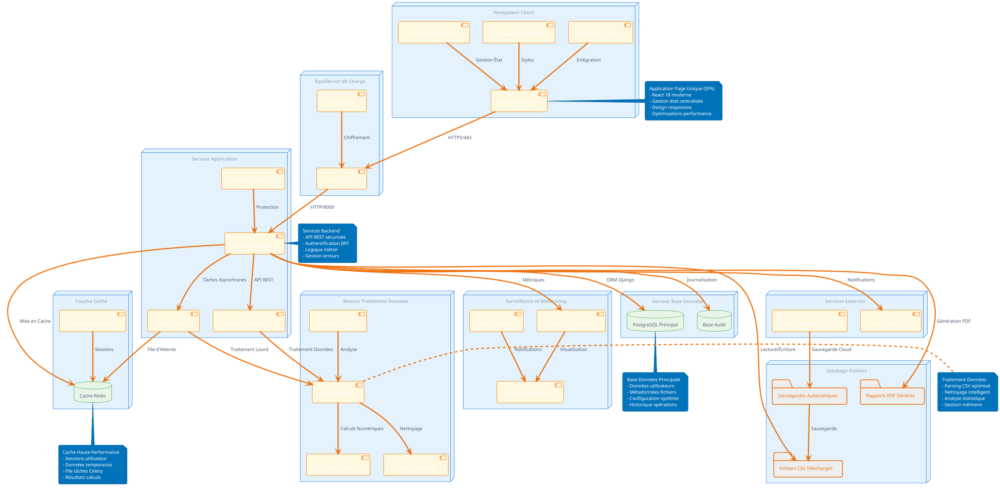
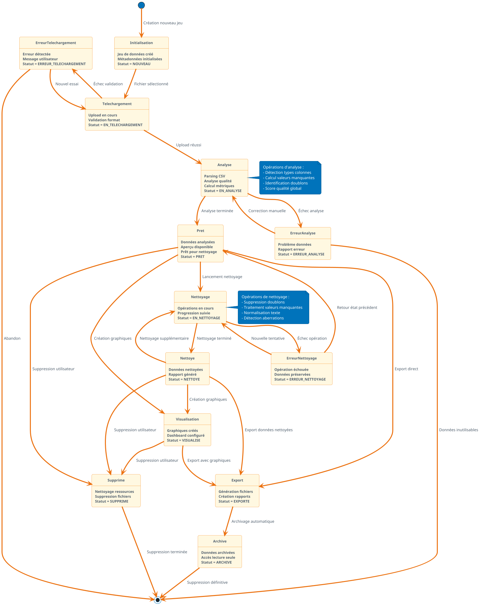

# 🎨 DIAGRAMMES UML EN FRANÇAIS - DIMACLEAN

## 1. DIAGRAMME DE CAS D'USAGE

```plantuml
@startuml DiagrammeCasUsage_DimaClean
!theme aws-orange
!define RECTANGLE_COLOR #E3F2FD
!define ACTOR_COLOR #1976D2

skinparam actor {
  BackgroundColor ACTOR_COLOR
  BorderColor #0D47A1
  FontColor white
  FontStyle bold
}

skinparam usecase {
  BackgroundColor #FFF3E0
  BorderColor #F57C00
  FontSize 11
}

skinparam package {
  BackgroundColor RECTANGLE_COLOR
  BorderColor #1976D2
  FontStyle bold
}

left to right direction

actor "Utilisateur\nStandard" as UtilisateurStandard
actor "Administrateur\nSystème" as AdminSysteme

rectangle "Système DimaClean" {

  package "Gestion des Fichiers" {
    usecase "Importer Fichier\nCSV" as UC01
    usecase "Prévisualiser\nDonnées" as UC02
    usecase "Gérer Liste\nFichiers" as UC03
    usecase "Supprimer\nFichier" as UC04
  }

  package "Traitement des Données" {
    usecase "Nettoyer\nDonnées" as UC05
    usecase "Transformer\nDonnées" as UC06
    usecase "Calculer\nStatistiques" as UC07
    usecase "Détecter\nDoublons" as UC08
    usecase "Gérer Valeurs\nManquantes" as UC09
  }

  package "Visualisation" {
    usecase "Créer\nGraphiques" as UC10
    usecase "Personnaliser\nTableau de Bord" as UC11
    usecase "Exporter\nVisualisations" as UC12
    usecase "Configurer\nAffichage" as UC13
  }

  package "Export et Rapports" {
    usecase "Exporter CSV\nNettoyé" as UC14
    usecase "Générer Rapport\nPDF" as UC15
    usecase "Télécharger\nRésultats" as UC16
  }

  package "Administration" {
    usecase "Gérer Comptes\nUtilisateurs" as UC17
    usecase "Superviser\nActivité Système" as UC18
    usecase "Consulter Journaux\nAudit" as UC19
    usecase "Configurer\nParamètres" as UC20
  }

  package "Authentification" {
    usecase "Se Connecter\nau Système" as UC21
    usecase "Gérer Profil\nUtilisateur" as UC22
    usecase "Changer Mot\nde Passe" as UC23
  }
}

' Relations Utilisateur Standard
UtilisateurStandard --> UC01
UtilisateurStandard --> UC02
UtilisateurStandard --> UC03
UtilisateurStandard --> UC04
UtilisateurStandard --> UC05
UtilisateurStandard --> UC06
UtilisateurStandard --> UC07
UtilisateurStandard --> UC08
UtilisateurStandard --> UC09
UtilisateurStandard --> UC10
UtilisateurStandard --> UC11
UtilisateurStandard --> UC12
UtilisateurStandard --> UC13
UtilisateurStandard --> UC14
UtilisateurStandard --> UC15
UtilisateurStandard --> UC16
UtilisateurStandard --> UC21
UtilisateurStandard --> UC22
UtilisateurStandard --> UC23

' Relations Administrateur
AdminSysteme --> UC17
AdminSysteme --> UC18
AdminSysteme --> UC19
AdminSysteme --> UC20
AdminSysteme --> UC21
AdminSysteme --> UC22
AdminSysteme --> UC23

' Extensions et Inclusions
UC01 ..> UC02 : <<inclut>>
UC05 ..> UC08 : <<inclut>>
UC05 ..> UC09 : <<inclut>>
UC05 ..> UC07 : <<inclut>>
UC10 ..> UC11 : <<étend>>
UC15 ..> UC07 : <<inclut>>
UC22 ..> UC23 : <<étend>>

' Notes explicatives
note right of UC05
  Nettoyage automatique inclut :
  - Suppression des doublons
  - Traitement valeurs manquantes
  - Normalisation des formats
  - Détection des aberrations
end note

note right of UC10
  Types de graphiques supportés :
  - Histogrammes
  - Graphiques en courbes
  - Diagrammes circulaires
  - Boîtes à moustaches
  - Nuages de points
end note

note bottom of UC17
  Gestion utilisateurs :
  - Création de comptes
  - Modification des droits
  - Désactivation/Suppression
  - Réinitialisation mots de passe
end note

@enduml
```



## 2. DIAGRAMME DE CLASSES DÉTAILLÉ

```plantuml
@startuml DiagrammeClasses_DimaClean_Simplifie
!theme aws-orange

skinparam class {
  BackgroundColor #FFF8E1
  BorderColor #F57C00
  FontSize 12
  FontStyle bold
}

skinparam enum {
  BackgroundColor #E8F5E8
  BorderColor #4CAF50
  FontSize 10
}

' Classes principales du domaine
class Utilisateur {
  +identifiant: UUID
  +email: Chaîne
  +nom_complet: Chaîne
  +role: RoleUtilisateur
  --
  +authentifier(): Booléen
  +obtenir_jeux_donnees(): Liste
}

enum RoleUtilisateur {
  ADMIN
  UTILISATEUR
}

class JeuDonnees {
  +identifiant: UUID
  +nom_fichier: Chaîne
  +taille_fichier: Entier
  +nombre_lignes: Entier
  +statut: StatutJeu
  +date_creation: DateHeure
  --
  +importer_csv(): Booléen
  +nettoyer_donnees(): Booléen
  +exporter_csv(): Chaîne
}

enum StatutJeu {
  NOUVEAU
  ANALYSE
  PRET
  NETTOYE
}

class TacheNettoyage {
  +identifiant: UUID
  +type_operations: Liste
  +progression: Réel
  +statut: StatutTache
  --
  +executer(): Booléen
  +obtenir_rapport(): Rapport
}

enum StatutTache {
  EN_COURS
  TERMINEE
  ECHOUEE
}

class Visualisation {
  +identifiant: UUID
  +titre: Chaîne
  +type_graphique: TypeGraphique
  --
  +generer_graphique(): Image
  +exporter_pdf(): Fichier
}

enum TypeGraphique {
  HISTOGRAMME
  COURBES
  CAMEMBERT
  BARRES
}

' Services principaux
class ServiceNettoyage {
  +nettoyer_doublons(): Booléen
  +traiter_valeurs_manquantes(): Booléen
  +normaliser_texte(): Booléen
}

class ServiceVisualisation {
  +creer_graphique(): Visualisation
  +generer_rapport_pdf(): Fichier
}

' Relations simplifiées
Utilisateur ||--o{ JeuDonnees : possède
JeuDonnees ||--o{ TacheNettoyage : nettoie_avec
JeuDonnees ||--o{ Visualisation : visualise_par
TacheNettoyage --> ServiceNettoyage : utilise
Visualisation --> ServiceVisualisation : utilise

' Notes explicatives
note right of JeuDonnees
  Classe centrale représentant
  un fichier CSV importé
  avec ses métadonnées
end note

note right of ServiceNettoyage
  Service contenant les
  algorithmes de nettoyage
  des données
end note

package "Services Métier" {

  abstract class ServiceBase {
    #journaliseur: Journaliseur
    #delai_cache: Entier
    --
    #gerer_erreur(erreur): ResultatService
    #resultat_succes(donnees): ResultatService
    #valider_entree(donnees): Booléen
  }

  class ServiceTraitementDonnees {
    -moteur_nettoyage: MoteurNettoyage
    -analyseur_donnees: AnalyseurDonnees
    -gestionnaire_cache: GestionnaireCache
    --
    +traiter_fichier_telecharge(fichier): ResultatService
    +nettoyer_jeu_donnees(id_jeu, config): ResultatService
    +obtenir_statistiques(id_jeu): ResultatService
    +exporter_jeu_donnees(id_jeu, format): ResultatService
    -valider_fichier(fichier): Booléen
    -mettre_en_cache_donnees(id_jeu, donnees): Vide
    -analyser_qualite_donnees(donnees): RapportQualite
  }

  class ServiceAuthentification {
    -cle_secrete_jwt: Chaîne
    -duree_expiration_token: Entier
    --
    +authentifier_utilisateur(email, mdp): ResultatService
    +generer_token(utilisateur): Chaîne
    +valider_token(token): Utilisateur
    +rafraichir_token(token): Chaîne
    +deconnecter_utilisateur(token): Booléen
    +changer_mot_de_passe(id_user, ancien_mdp, nouveau_mdp): Booléen
  }

  class ServiceVisualisation {
    -fabrique_graphiques: FabriqueGraphiques
    -moteur_rendu: MoteurRendu
    --
    +creer_graphique(id_jeu, config): ResultatService
    +modifier_graphique(id_graphique, config): ResultatService
    +exporter_graphique(id_graphique, format): ResultatService
    +obtenir_donnees_graphique(id_graphique): ResultatService
    +generer_tableau_bord(id_tableau): ResultatService
  }

  class ServiceRapports {
    -generateur_pdf: GenerateurPDF
    -moteur_templates: MoteurTemplates
    -exportateur_donnees: ExportateurDonnees
    --
    +generer_rapport_nettoyage(id_tache): ResultatService
    +generer_rapport_tableau_bord(id_tableau): ResultatService
    +exporter_resume_jeu_donnees(id_jeu): ResultatService
    +creer_rapport_personnalise(config): ResultatService
  }

  class ServiceGestionUtilisateurs {
    -validateur_donnees: ValidateurDonnees
    -gestionnaire_roles: GestionnaireRoles
    --
    +creer_utilisateur(donnees): ResultatService
    +modifier_utilisateur(id_user, donnees): ResultatService
    +supprimer_utilisateur(id_user): ResultatService
    +lister_utilisateurs(filtres): ResultatService
    +gerer_permissions(id_user, permissions): ResultatService
  }
}

package "Stratégies de Nettoyage" {

  interface StrategieNettoyage {
    +executer(tableau_donnees, config): ResultatNettoyage
    +valider_configuration(config): Booléen
    +obtenir_description(): Chaîne
  }

  class StrategieSuppressionDoublons {
    +executer(tableau_donnees, config): ResultatNettoyage
    +valider_configuration(config): Booléen
    +obtenir_description(): Chaîne
    -detecter_doublons(donnees): Serie
    -supprimer_doublons_exacts(donnees): TableauDonnees
    -supprimer_doublons_approximatifs(donnees): TableauDonnees
  }

  class StrategieValeursManquantes {
    +executer(tableau_donnees, config): ResultatNettoyage
    +valider_configuration(config): Booléen
    +obtenir_description(): Chaîne
    -determiner_strategie(serie): Chaîne
    -appliquer_strategie(serie, strategie): Quelconque
    -calculer_valeur_remplacement(serie, methode): Quelconque
  }

  class StrategieDetectionAberrations {
    +executer(tableau_donnees, config): ResultatNettoyage
    +valider_configuration(config): Booléen
    +obtenir_description(): Chaîne
    -detecter_aberrations(serie, methode): Serie
    -limiter_aberrations(donnees, colonne, masque): TableauDonnees
    -calculer_seuils_iqr(serie): Tuple
  }

  class StrategieNormalisationTexte {
    +executer(tableau_donnees, config): ResultatNettoyage
    +valider_configuration(config): Booléen
    +obtenir_description(): Chaîne
    -normaliser_casse(texte): Chaîne
    -supprimer_espaces_superflus(texte): Chaîne
    -normaliser_caracteres_speciaux(texte): Chaîne
  }

  class MoteurNettoyage {
    -strategies: Dictionnaire<Chaîne, StrategieNettoyage>
    -journaliseur: Journaliseur
    --
    +nettoyer_donnees(tableau_donnees, config): ResultatNettoyage
    +enregistrer_strategie(nom, strategie): Vide
    +obtenir_strategies_disponibles(): Liste<Chaîne>
    +executer_strategie(nom_strategie, donnees, config): ResultatNettoyage
  }
}

' Relations entre les classes
Utilisateur ||--o{ JeuDonnees : possède
Utilisateur ||--o{ TableauBord : crée
Utilisateur ||--o{ Visualisation : crée
Utilisateur ||--o{ JournalAudit : génère

JeuDonnees ||--o{ TacheNettoyage : traite
JeuDonnees ||--o{ Visualisation : visualise
JeuDonnees ||--o{ ProfilDonnees : profile

TacheNettoyage ||--o{ OperationNettoyage : contient

TableauBord ||--o{ Visualisation : affiche

ServiceBase <|-- ServiceTraitementDonnees
ServiceBase <|-- ServiceAuthentification
ServiceBase <|-- ServiceVisualisation
ServiceBase <|-- ServiceRapports
ServiceBase <|-- ServiceGestionUtilisateurs

StrategieNettoyage <|.. StrategieSuppressionDoublons
StrategieNettoyage <|.. StrategieValeursManquantes
StrategieNettoyage <|.. StrategieDetectionAberrations
StrategieNettoyage <|.. StrategieNormalisationTexte

MoteurNettoyage o-- StrategieNettoyage : utilise

ServiceTraitementDonnees --> MoteurNettoyage : utilise
ServiceTraitementDonnees --> JeuDonnees : gère
ServiceAuthentification --> Utilisateur : authentifie
ServiceVisualisation --> Visualisation : gère
ServiceRapports --> JeuDonnees : rapporte

' Notes explicatives
note right of MoteurNettoyage
  Le moteur de nettoyage orchestre
  l'exécution des différentes stratégies
  selon la configuration utilisateur
end note

note bottom of StrategieNettoyage
  Pattern Strategy pour permettre
  l'ajout facile de nouvelles
  méthodes de nettoyage
end note

@enduml
```



## 3. DIAGRAMME DE SÉQUENCE - TÉLÉCHARGEMENT ET NETTOYAGE

```plantuml
@startuml DiagrammeSequence_TelechargerNettoyer
!theme aws-orange

skinparam participant {
  BackgroundColor #E3F2FD
  BorderColor #1976D2
  FontStyle bold
}

skinparam actor {
  BackgroundColor #FFF3E0
  BorderColor #F57C00
}

actor "Utilisateur" as Utilisateur
participant "Interface\nReact" as InterfaceReact
participant "API\nDjango" as APIDjango
participant "Service Traitement\nDonnées" as ServiceTraitement
participant "Moteur\nNettoyage" as MoteurNettoyage
participant "Base de\nDonnées" as BaseDonnees
participant "Cache\nRedis" as CacheRedis

== Phase 1: Téléchargement du fichier ==

Utilisateur -> InterfaceReact: Sélectionne fichier CSV
activate InterfaceReact

InterfaceReact -> InterfaceReact: Validation côté client\n(taille, format, extension)
note right: Vérifications :\n- Taille < 100MB\n- Extension .csv\n- Type MIME correct

InterfaceReact -> APIDjango: POST /api/telecharger-fichier/\n(multipart/form-data)
activate APIDjango

APIDjango -> ServiceTraitement: traiter_fichier_telecharge(fichier)
activate ServiceTraitement

ServiceTraitement -> ServiceTraitement: valider_fichier(fichier)
note right: Validations sécurité :\n- Signature fichier\n- Contenu malveillant\n- Encodage supporté

ServiceTraitement -> ServiceTraitement: analyser_fichier_csv(fichier)
note right: Analyse automatique :\n- Détection délimiteur\n- Types de colonnes\n- Encodage caractères

ServiceTraitement -> ServiceTraitement: analyser_qualite_donnees(donnees)
note right: Métriques qualité :\n- Valeurs manquantes\n- Doublons potentiels\n- Cohérence types

ServiceTraitement -> BaseDonnees: creer_enregistrement_jeu_donnees()
activate BaseDonnees
BaseDonnees --> ServiceTraitement: identifiant_jeu_donnees
deactivate BaseDonnees

ServiceTraitement -> CacheRedis: mettre_en_cache_donnees(id_jeu, donnees)
activate CacheRedis
CacheRedis --> ServiceTraitement: succès
deactivate CacheRedis

ServiceTraitement --> APIDjango: ResultatService(jeu_donnees, analyse, apercu)
deactivate ServiceTraitement

APIDjango --> InterfaceReact: Réponse JSON\n(infos jeu + aperçu + statistiques)
deactivate APIDjango

InterfaceReact --> Utilisateur: Affiche aperçu données\net métriques de qualité
deactivate InterfaceReact

== Phase 2: Configuration et lancement du nettoyage ==

Utilisateur -> InterfaceReact: Configure options\nde nettoyage
activate InterfaceReact
note right: Options disponibles :\n- Supprimer doublons\n- Traiter valeurs manquantes\n- Normaliser texte\n- Détecter aberrations

InterfaceReact -> InterfaceReact: Valider configuration\nutilisateur

InterfaceReact -> APIDjango: POST /api/jeux-donnees/{id}/nettoyer/\n(configuration_nettoyage)
activate APIDjango

APIDjango -> ServiceTraitement: nettoyer_jeu_donnees(id_jeu, configuration)
activate ServiceTraitement

ServiceTraitement -> BaseDonnees: obtenir_jeu_donnees(id_jeu)
activate BaseDonnees
BaseDonnees --> ServiceTraitement: jeu_donnees
deactivate BaseDonnees

ServiceTraitement -> CacheRedis: obtenir_donnees_mises_en_cache(id_jeu)
activate CacheRedis
CacheRedis --> ServiceTraitement: tableau_donnees
deactivate CacheRedis

ServiceTraitement -> MoteurNettoyage: nettoyer_donnees(tableau_donnees, configuration)
activate MoteurNettoyage

loop Pour chaque opération de nettoyage configurée
    MoteurNettoyage -> MoteurNettoyage: executer_strategie(operation)
    note right: Stratégies appliquées :\n- Suppression doublons\n- Remplacement valeurs manquantes\n- Normalisation texte\n- Limitation aberrations

    MoteurNettoyage -> BaseDonnees: enregistrer_operation_nettoyage()
    activate BaseDonnees
    BaseDonnees --> MoteurNettoyage: succès
    deactivate BaseDonnees
end

MoteurNettoyage --> ServiceTraitement: ResultatNettoyage\n(donnees_nettoyees, journal_operations)
deactivate MoteurNettoyage

ServiceTraitement -> BaseDonnees: mettre_a_jour_statut_jeu(NETTOYE)
activate BaseDonnees
BaseDonnees --> ServiceTraitement: succès
deactivate BaseDonnees

ServiceTraitement -> CacheRedis: mettre_en_cache_donnees(id_jeu, donnees_nettoyees, "_nettoye")
activate CacheRedis
CacheRedis --> ServiceTraitement: succès
deactivate CacheRedis

ServiceTraitement --> APIDjango: ResultatService(donnees_nettoyees, resume_operations)
deactivate ServiceTraitement

APIDjango --> InterfaceReact: Réponse JSON\n(résultats nettoyage + rapport)
deactivate APIDjango

InterfaceReact --> Utilisateur: Affiche données nettoyées\net rapport détaillé des opérations
deactivate InterfaceReact

== Phase 3: Gestion des erreurs et cas exceptionnels ==

alt Erreur de validation fichier
    ServiceTraitement -> APIDjango: ResultatService(erreur_validation)
    APIDjango -> InterfaceReact: HTTP 400 + message erreur détaillé
    InterfaceReact -> Utilisateur: Message d'erreur explicite\navec suggestions correction

else Erreur de traitement données
    ServiceTraitement -> ServiceTraitement: journaliser_erreur()
    ServiceTraitement -> APIDjango: ResultatService(erreur_traitement)
    APIDjango -> InterfaceReact: HTTP 500 + message erreur technique
    InterfaceReact -> Utilisateur: Message d'erreur + contact support

else Dépassement de délai (timeout)
    ServiceTraitement -> ServiceTraitement: annuler_operation()
    ServiceTraitement -> APIDjango: ResultatService(delai_depasse)
    APIDjango -> InterfaceReact: HTTP 408 + message timeout
    InterfaceReact -> Utilisateur: Option de réessayer\navec fichier plus petit

else Fichier trop volumineux
    ServiceTraitement -> APIDjango: ResultatService(fichier_trop_gros)
    APIDjango -> InterfaceReact: HTTP 413 + limite taille
    InterfaceReact -> Utilisateur: Suggestion de diviser\nle fichier ou contacter admin
end

@enduml
```



## 4. DIAGRAMME D'ACTIVITÉ - PROCESSUS DE NETTOYAGE

```plantuml
@startuml DiagrammeActivite_ProcessusNettoyage
!theme aws-orange

skinparam activity {
  BackgroundColor #FFF8E1
  BorderColor #F57C00
  FontSize 10
}

skinparam decision {
  BackgroundColor #E8F5E8
  BorderColor #4CAF50
}

start

:Utilisateur télécharge fichier CSV;
note right: Formats supportés :\n- CSV (délimiteurs : , ; |)\n- Taille max : 100MB

:Validation sécurité du fichier;
note right: Vérifications :\n- Signature fichier\n- Contenu malveillant\n- Extension autorisée

if (Fichier sécurisé et valide ?) then (non)
  :Afficher message d'erreur\nde sécurité;
  note right: Messages spécifiques :\n- Fichier corrompu\n- Type non supporté\n- Taille excessive
  stop
else (oui)
  :Analyser structure du fichier CSV;
  note right: Détection automatique :\n- Délimiteur utilisé\n- Encodage caractères\n- En-têtes colonnes
endif

:Analyser qualité des données;
note right: Calcul métriques :\n- % valeurs manquantes\n- Nombre de doublons\n- Types de données\n- Score qualité global

:Afficher aperçu et statistiques\nà l'utilisateur;

:Utilisateur configure\nles options de nettoyage;
note right: Options disponibles :\n- Suppression doublons\n- Traitement valeurs manquantes\n- Normalisation texte\n- Détection aberrations

' Analyse parallèle des problèmes
fork
  :Analyser les doublons;
  if (Doublons détectés ?) then (oui)
    :Identifier types de doublons\n(exacts/approximatifs);
    :Calculer impact suppression;
  else (non)
    :Marquer : Aucun doublon;
  endif
fork again
  :Analyser valeurs manquantes;
  if (Valeurs manquantes détectées ?) then (oui)
    :Déterminer stratégie optimale\npar colonne;
    note right: Stratégies :\n- Médiane (numérique)\n- Mode (catégoriel)\n- Interpolation (temporel)
  else (non)
    :Marquer : Données complètes;
  endif
fork again
  :Analyser aberrations statistiques;
  if (Aberrations détectées ?) then (oui)
    :Calculer seuils de détection\n(IQR, Z-score);
    :Évaluer impact traitement;
  else (non)
    :Marquer : Pas d'aberrations;
  endif
end fork

:Lancer processus de nettoyage\nselon configuration;

partition "Exécution Séquentielle des Opérations" {

  if (Supprimer les doublons ?) then (oui)
    :Appliquer stratégie suppression\ndes doublons;
    :Enregistrer opération dans journal;
    note right: Journalisation :\n- Nombre lignes supprimées\n- Critères utilisés\n- Horodatage
  else (non)
    :Ignorer suppression doublons;
  endif

  if (Traiter valeurs manquantes ?) then (oui)
    :Appliquer stratégies de remplacement\npar colonne;
    :Enregistrer détails remplacement;
    note right: Pour chaque colonne :\n- Méthode utilisée\n- Valeur de remplacement\n- Nombre cellules modifiées
  else (non)
    :Conserver valeurs manquantes;
  endif

  if (Traiter les aberrations ?) then (oui)
    :Appliquer traitement des aberrations\n(suppression/limitation);
    :Documenter aberrations traitées;
  else (non)
    :Conserver aberrations;
  endif

  if (Normaliser le texte ?) then (oui)
    :Normaliser colonnes textuelles;
    note right: Normalisations :\n- Casse uniforme\n- Espaces superflus\n- Caractères spéciaux
    :Enregistrer transformations texte;
  else (non)
    :Conserver formatage original;
  endif
}

:Calculer nouvelles statistiques\nsur données nettoyées;

:Générer rapport détaillé\ndes opérations;
note right: Contenu rapport :\n- Résumé opérations\n- Statistiques avant/après\n- Recommandations\n- Graphiques comparatifs

:Sauvegarder données nettoyées\nen cache et base;

:Présenter résultats\nà l'utilisateur;
note right: Affichage :\n- Aperçu données nettoyées\n- Rapport opérations\n- Métriques amélioration\n- Options export

if (Utilisateur satisfait des résultats ?) then (non)
  :Permettre ajustement\nde la configuration;
  note right: L'utilisateur peut :\n- Modifier paramètres\n- Annuler certaines opérations\n- Relancer le nettoyage
  backward :Reconfigurer options\nde nettoyage;
else (oui)
  :Proposer options d'export\net de visualisation;
  note right: Options disponibles :\n- Export CSV nettoyé\n- Génération rapport PDF\n- Création graphiques\n- Sauvegarde configuration
endif

:Finaliser le processus;

stop

@enduml
```

## 5. DIAGRAMME DE DÉPLOIEMENT



## 6. DIAGRAMME D'ÉTAT - CYCLE DE VIE D'UN JEU DE DONNÉES



## 7. DIAGRAMME DE COMMUNICATION - INTERACTION COMPOSANTS

```plantuml
@startuml DiagrammeCommunication_InteractionComposants
!theme aws-orange

skinparam object {
  BackgroundColor #E3F2FD
  BorderColor #1976D2
}

object ":InterfaceUtilisateur" as IU
object ":ControlleurPrincipal" as CP
object ":ServiceAuthentification" as SA
object ":ServiceTraitementDonnees" as STD
object ":MoteurNettoyage" as MN
object ":GestionnaireCache" as GC
object ":AccesDonnees" as AD

IU -> CP : 1: authentifierUtilisateur(identifiants)
CP -> SA : 1.1: validerIdentifiants(email, motDePasse)
SA -> AD : 1.1.1: rechercherUtilisateur(email)
AD --> SA : 1.1.2: utilisateurTrouve
SA --> CP : 1.2: tokenAuthentification
CP --> IU : 1.3: connexionReussie(token)

IU -> CP : 2: telechargerFichier(fichierCSV)
CP -> STD : 2.1: traiterFichierTelecharge(fichier)
STD -> STD : 2.1.1: validerFichier(fichier)
STD -> STD : 2.1.2: analyserQualiteDonnees(donnees)
STD -> AD : 2.1.3: sauvegarderJeuDonnees(metadonnees)
STD -> GC : 2.1.4: mettreEnCacheDonnees(identifiant, donnees)
STD --> CP : 2.2: resultatTraitement(jeuDonnees, analyse)
CP --> IU : 2.3: afficherApercu(donnees, statistiques)

IU -> CP : 3: configurerNettoyage(parametres)
CP -> STD : 3.1: lancerNettoyage(identifiantJeu, configuration)
STD -> GC : 3.1.1: recupererDonneesMiseEnCache(identifiant)
STD -> MN : 3.1.2: nettoyerDonnees(donnees, configuration)
MN -> MN : 3.1.2.1: appliquerStrategies(operations)
MN --> STD : 3.1.3: donneesNettoyees(resultat, journal)
STD -> AD : 3.1.4: sauvegarderOperations(journal)
STD -> GC : 3.1.5: mettreEnCacheDonneesNettoyees(identifiant, donnees)
STD --> CP : 3.2: nettoyageTermine(donnees, rapport)
CP --> IU : 3.3: afficherResultats(donneesNettoyees, rapportOperations)

IU -> CP : 4: exporterDonnees(format)
CP -> STD : 4.1: genererExport(identifiantJeu, formatExport)
STD -> GC : 4.1.1: recupererDonneesNettoyees(identifiant)
STD -> STD : 4.1.2: formaterDonnees(donnees, format)
STD --> CP : 4.2: fichierExporte(cheminFichier)
CP --> IU : 4.3: proposerTelechargement(fichier)

note right of SA
  Gestion sécurisée
  des authentifications
  avec tokens JWT
end note

note right of MN
  Application des stratégies
  de nettoyage selon
  le pattern Strategy
end note

note right of GC
  Cache haute performance
  pour optimiser les
  accès aux données
end note

@enduml
```



---

## 📋 RÉSUMÉ DES DIAGRAMMES UML EN FRANÇAIS

Ces diagrammes UML professionnels en français couvrent tous les aspects importants de votre projet DimaClean :

### **🎯 Diagrammes Créés :**

1. **Diagramme de Cas d'Usage** - Vue fonctionnelle complète du système
2. **Diagramme de Classes** - Architecture orientée objet détaillée
3. **Diagramme de Séquence** - Flux d'interactions temporelles
4. **Diagramme d'Activité** - Processus métier de nettoyage
5. **Diagramme de Déploiement** - Architecture technique d'infrastructure
6. **Diagramme d'État** - Cycle de vie des jeux de données
7. **Diagramme de Communication** - Interactions entre composants

### **✨ Caractéristiques :**
- **Terminologie française** complète
- **Noms de classes traduits** (Utilisateur, JeuDonnees, etc.)
- **Commentaires explicatifs** en français
- **Styling professionnel** avec thème cohérent
- **Prêts pour rapport de stage** et présentation

### **📖 Utilisation :**
- Copiez les codes PlantUML dans votre outil préféré
- Générez les diagrammes en PNG/SVG pour votre rapport
- Utilisez-les pour expliquer l'architecture à votre encadrant
- Intégrez-les dans votre présentation de soutenance

Ces diagrammes constituent une base solide pour documenter professionnellement votre projet DimaClean ! 🚀
