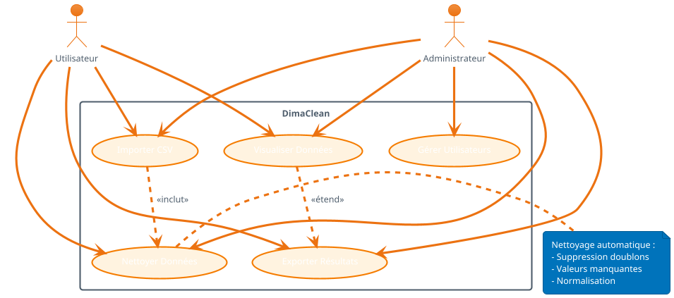
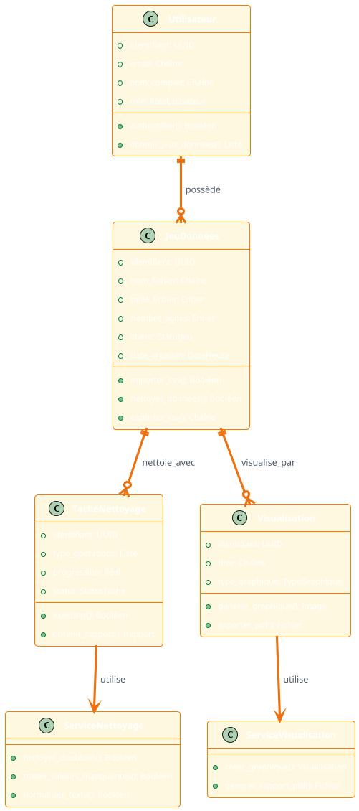
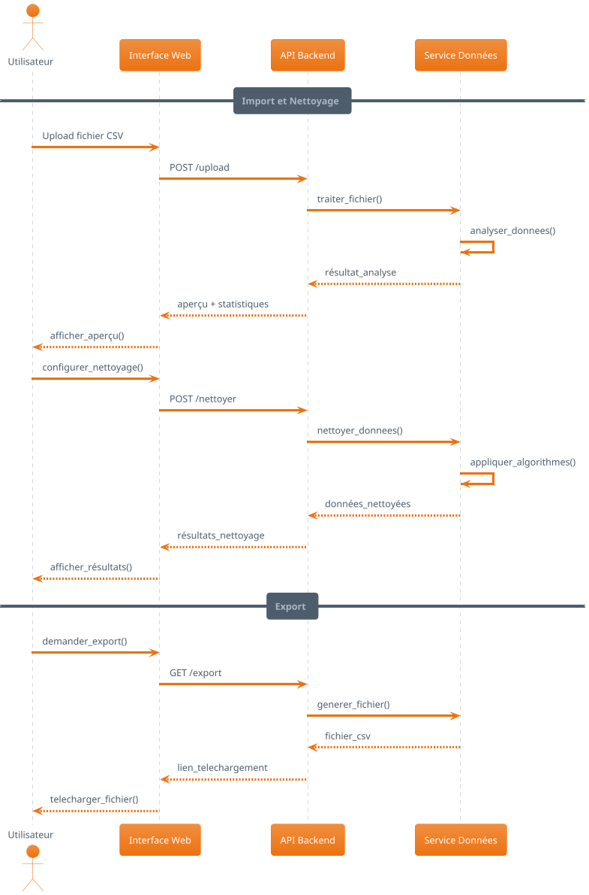
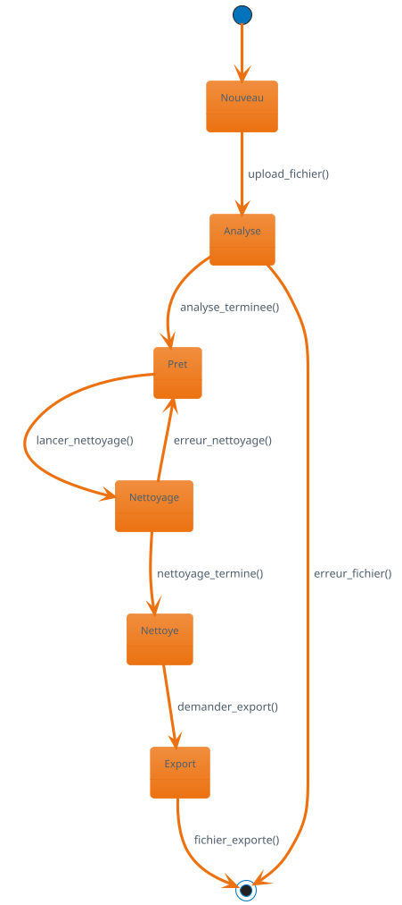

# 🎨 DIAGRAMMES UML SIMPLIFIÉS - DIMACLEAN

## 📋 VERSION SIMPLIFIÉE POUR RAPPORT DE STAGE

Ces diagrammes sont épurés et se concentrent sur l'essentiel pour une meilleure compréhension.

---

## 1. 📊 DIAGRAMME DE CAS D'USAGE SIMPLIFIÉ



---

## 2. 🏗️ DIAGRAMME DE CLASSES SIMPLIFIÉ



---

## 3. 🔄 DIAGRAMME DE SÉQUENCE SIMPLIFIÉ



---

## 4. ⚡ DIAGRAMME D'ACTIVITÉ SIMPLIFIÉ

```plantuml
@startuml Activite_DimaClean_Simple
!theme aws-orange

start

:Upload fichier CSV;

if (Fichier valide ?) then (oui)
  :Analyser données;
  :Afficher aperçu;
  :Configurer nettoyage;
  
  fork
    :Supprimer doublons;
  fork again
    :Traiter valeurs manquantes;
  fork again
    :Normaliser texte;
  end fork
  
  :Générer rapport;
  :Afficher résultats;
  
  if (Satisfait ?) then (oui)
    :Exporter données;
    stop
  else (non)
    backward :Reconfigurer;
  endif
  
else (non)
  :Afficher erreur;
  stop
endif

@enduml
```

---

## 5. 🏢 DIAGRAMME DE DÉPLOIEMENT SIMPLIFIÉ

```plantuml
@startuml Deploiement_DimaClean_Simple
!theme aws-orange

node "Navigateur" {
  component "React App" as React
}

node "Serveur Web" {
  component "Django API" as Django
  component "Pandas Engine" as Pandas
}

node "Base de Données" {
  database "PostgreSQL" as DB
}

node "Cache" {
  database "Redis" as Cache
}

React --> Django : HTTPS
Django --> Pandas : Traitement
Django --> DB : Données
Django --> Cache : Session

@enduml
```

---

## 6. 🔄 DIAGRAMME D'ÉTAT SIMPLIFIÉ



---

## 📋 AVANTAGES DE LA VERSION SIMPLIFIÉE

### ✅ **Plus Lisible**
- Moins d'attributs et méthodes
- Focus sur l'essentiel
- Diagrammes plus clairs

### ✅ **Mieux pour Présentation**
- Compréhension rapide
- Explications facilitées
- Moins de surcharge visuelle

### ✅ **Adapté au Rapport de Stage**
- Niveau de détail approprié
- Concepts principaux mis en avant
- Facilite la compréhension du jury

### 🎯 **Utilisation Recommandée**
- **Présentation orale** : Version simplifiée
- **Rapport technique** : Version détaillée en annexe
- **Documentation utilisateur** : Version simplifiée
- **Documentation développeur** : Version détaillée

---

## 🚀 COMMENT UTILISER

1. **Copiez le code PlantUML** de votre choix
2. **Générez l'image** avec PlantUML Online
3. **Intégrez dans votre rapport** de stage
4. **Utilisez pour expliquer** à votre encadrant

Ces diagrammes simplifiés sont parfaits pour votre soutenance et votre rapport de stage ! 🎯
